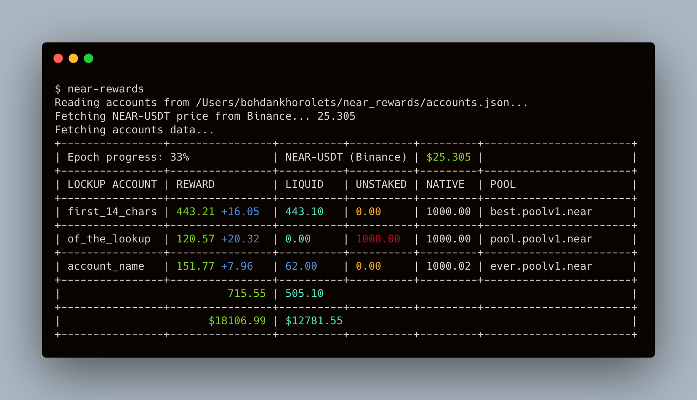

# near_rewards

Small console application to check the rewards for lockup accounts in NEAR protocol.

## Example result:



## Usage

1. Create folder in your home folder `near_rewards`. 

2. Add file `accounts.json` with structure

```json
[
  {
    "account_id": "account.near",
    "pool_account_id": "pool.poolv1.near"
  }
]
```

3. Run `near_rewards`
